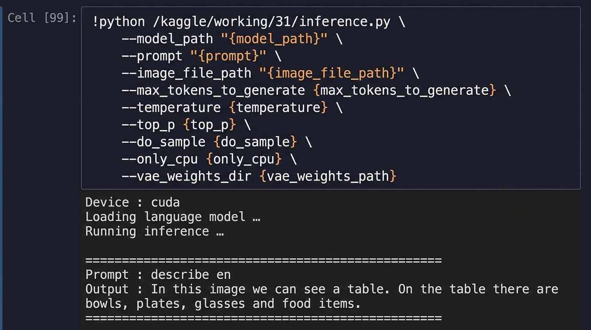

# PaliGemma VLM — Vision Language Model from Scratch

A from-scratch PyTorch implementation of **PaliGemma 3B**, Google's open vision-language model, combining a **SigLIP** vision encoder with a **Gemma 2** language model backbone. Supports image captioning, object detection, and instance segmentation — all from a single unified inference script.

---

## Architecture

```
Input Image  ──►  SigLIP Vision Encoder  ──►  Image Tokens ─┐
                                                              ├─► PaliGemma Transformer ──► Generated Text
Text Prompt  ──►  Tokenizer              ──►  Text  Tokens ─┘
```

| Component | File | Description |
|---|---|---|
| SigLIP Vision Encoder | `modeling_siglip.py` | Patch-based ViT encoder (224×224, patch size 14) |
| Gemma 2 LM Backbone | `modeling_gemma.py` | 26-layer decoder with GQA, RoPE, RMSNorm |
| Processor | `processing_paligemma.py` | Image + text tokenization pipeline |
| Inference | `inference.py` | End-to-end generation with detection & segmentation |
| VAE Decoder | `variational_autoencoder.py` | OID VQ-VAE for segmentation mask rendering |
| Utils | `utils.py` | HuggingFace checkpoint loader |

---

## Features

- **Image Captioning** — describe any image in natural language
- **Object Detection** — predict bounding boxes via `<locXXXX>` tokens
- **Instance Segmentation** — generate pixel masks via VQ-VAE codebook tokens
- **KV-Cache** — efficient autoregressive decoding with key-value caching
- **Nucleus Sampling** — top-p sampling with temperature control
- **CPU / CUDA** — runs on both CPU and GPU

---

## Installation

```bash
git clone https://github.com/your-username/VLM.git
cd VLM
pip install -r requirements.txt
```

For development and tests, install the project with its optional test dependency:

```bash
pip install -e ".[dev]"
```

**Requirements (key packages):**

| Package | Version |
|---|---|
| torch | `>=2.3.0, <2.5.0` |
| transformers | `>=4.44.0, <5.0.0` |
| safetensors | `>=0.4.3` |
| Pillow | `>=10.3.0` |
| sentencepiece | latest |
| huggingface-hub | `>=0.23.0, <1.0` |

---

## Model Weights

Download the PaliGemma 3B pretrained weights from HuggingFace and place them under `data/`:

```
data/
├── paligemma-weights/
│   └── paligemma-3b-pt-224/    ← model checkpoint directory
├── vae-oid/                    ← OID VAE weights (for segmentation)
└── test_imgs/                  ← your input images
```

---

## Usage

### Quick Start (via shell script)

Edit `run.sh` to set your paths and prompt, then:

```bash
bash run.sh
```

### CLI — Image Captioning

```bash
python inference.py \
  --model_path data/paligemma-weights/paligemma-3b-pt-224 \
  --prompt "caption en" \
  --image_file_path data/test_imgs/img001.jpg \
  --max_tokens_to_generate 100
```

### CLI — Object Detection

```bash
python inference.py \
  --model_path data/paligemma-weights/paligemma-3b-pt-224 \
  --prompt "detect dog" \
  --image_file_path data/test_imgs/img001.jpg
```

### CLI — Instance Segmentation

```bash
python inference.py \
  --model_path data/paligemma-weights/paligemma-3b-pt-224 \
  --prompt "segment dog" \
  --image_file_path data/test_imgs/img001.jpg \
  --vae_weights_dir data/vae-oid
```

### Tests

Run the component tests from the repository root:

```bash
python -m pytest
```

### All Arguments

| Argument | Default | Description |
|---|---|---|
| `--model_path` | — | Path to PaliGemma checkpoint directory |
| `--prompt` | — | Task prompt (e.g. `"caption en"`, `"detect cat"`) |
| `--image_file_path` | — | Path to the input image |
| `--max_tokens_to_generate` | `200` | Max new tokens to generate |
| `--temperature` | `0.8` | Sampling temperature (when `do_sample=True`) |
| `--top_p` | `0.9` | Nucleus sampling threshold |
| `--do_sample` | `False` | Use nucleus sampling (else greedy) |
| `--only_cpu` | `False` | Force CPU even if CUDA is available |
| `--vae_weights_dir` | `None` | VAE weights dir (required for segmentation masks) |

---

## Test Output

Running the model on a table-scene image with `--prompt "describe en"`:



> **Device:** CUDA · **Prompt:** `describe en`
> **Output:** *"In this image we can see a table. On the table there are bowls, plates, glasses and food items."*

---

## Project Structure

```
VLM/
├── inference.py               # Main inference entry-point
├── modeling_gemma.py          # Gemma 2 language model (KV-cache, GQA, RoPE)
├── modeling_siglip.py         # SigLIP vision encoder (ViT backbone)
├── processing_paligemma.py    # PaliGemma processor (image + text)
├── variational_autoencoder.py # OID VQ-VAE decoder for segmentation masks
├── utils.py                   # HuggingFace weight loading utilities
├── tests/                     # Component tests
│   └── test_components.py
├── run.sh                     # Convenience run script
├── pyproject.toml              # Project and pytest configuration
├── requirements.txt           # Python dependencies
├── assets/                    # Images for documentation
└── data/
    ├── paligemma-weights/     # Model checkpoint
    ├── vae-oid/               # VAE weights
    └── test_imgs/             # Input test images
```

---

## License

This project is for educational purposes. Model weights are subject to [Google's PaliGemma terms of use](https://ai.google.dev/gemma/terms).
